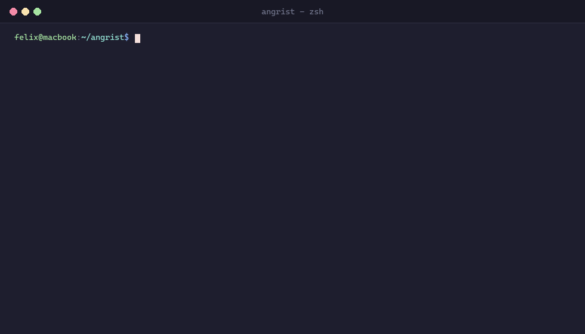

# Angrist

> *"As Angrist carved the Silmaril from the Iron Crown of Morgoth: excise the flaw, preserve the tree."*

[](https://github.com/flxhrdyn/angrist/actions/workflows/ci.yml)


[](https://pypi.org/project/angrist/)
[](https://www.python.org/downloads/)
[](https://opensource.org/licenses/MIT)


A fast, lightweight, and mathematically constrained AI coding micro-agent for targeted, single-function Python bug repairs. Built on Tree-sitter AST scope-locking and Git-worktree isolation to completely eliminate hallucinations, drift, and repository corruption.

Model-agnostic by design: works out of the box with local inference runtimes (Ollama, vLLM), open-weights models (Qwen 2.5 Coder, Llama 3.3, DeepSeek), as well as fast cloud APIs (Groq, OpenRouter, OpenAI) with zero proprietary vendor lock-in.




---

## Overview

When developers ask LLMs to fix a single bug in a codebase, traditional coding agents often rewrite entire files, delete comments, hallucinate uninstalled dependencies, or silently break unrelated functions.

**Angrist** solves this with absolute architectural constraints:

- **Model-Agnostic & Open First:** Built to thrive on open-weights and local models without needing massive multi-hundred-billion parameter proprietary cloud APIs. Any OpenAI-compatible `/chat/completions` endpoint works seamlessly.
- **Tree-sitter AST Scope Guard:** Edits are restricted down to the byte level. The agent can only modify the target function or method body. Any edits to sibling functions, class attributes, uncalled top-level blocks, or target renames/deletions trigger an immediate, hard rollback.
- **Git-Worktree Sandbox Isolation:** All LLM patches, unit test runs, and linters run in ephemeral, isolated Git worktrees. Your active workspace, staged changes, and working branch remain 100% clean and untouched.
- **Conservative Delta Gating:**
  - **Test Gate:** Evaluates tests before and after the patch. Distinguishes preexisting baseline failures from new regressions, and catches cases where failures turn into fatal collection or import errors.
  - **Lint Gate:** Set-based multi-format comparator (JSON & concise text) comparing rule signatures `(file, rule_code)` without being fooled by line-number shifts.
- **Atomic Cleanup:** Custom Python 3.12+ `onexc` filesystem handlers cleanly reclaim read-only Windows `.git` metadata and purge sandboxes without manual intervention.


---

## Installation

Install using `uv` (recommended), `pipx`, or standard `pip`:

```bash
uv tool install angrist
# or
pipx install angrist
# or for local development
pip install -e ".[dev]"
```

### Dependencies
- Python 3.11+
- Git 2.20+ (for worktree management)
- Tree-sitter & Tree-sitter Python

---

## Configuration

Angrist resolves configuration with the following precedence:
**CLI Flags > Environment Variables > `.env` file > Defaults**.

Copy `.env.example` to `.env` in your project or home directory:

```bash
cp .env.example .env
```

Configure your preferred LLM provider:

```ini
# --- Default: Groq (Free & Ultra-Fast) ---
ANGRIST_LLM_BASE_URL=https://api.groq.com/openai/v1
ANGRIST_LLM_API_KEY=gsk_your_groq_api_key_here
ANGRIST_LLM_MODEL=llama-3.3-70b-versatile

# --- Preset: Local Ollama (Zero API Cost) ---
# ANGRIST_LLM_BASE_URL=http://localhost:11434/v1
# ANGRIST_LLM_API_KEY=
# ANGRIST_LLM_MODEL=qwen2.5-coder:7b

# --- Preset: Local vLLM ---
# ANGRIST_LLM_BASE_URL=http://localhost:8000/v1
# ANGRIST_LLM_API_KEY=none
# ANGRIST_LLM_MODEL=deepseek-ai/DeepSeek-Coder-V2-Lite-Instruct

# --- Preset: OpenRouter / OpenAI ---
# ANGRIST_LLM_BASE_URL=https://openrouter.ai/api/v1
# ANGRIST_LLM_API_KEY=sk-or-...
# ANGRIST_LLM_MODEL=anthropic/claude-3.5-sonnet
```

---

## Quick Start

### 1. Fix a Standalone Function
Fix a targeted top-level function without affecting anything else in the file:

```bash
angrist fix \
  --file demo/payment_processor.py \
  --target PaymentProcessor.settle_batch \
  --instruction "Fix fee deduction precedence and update transaction status" \
  --test-cmd "pytest demo/test_payment_processor.py"
```

### 2. Fix a Module Function
Target a top-level function directly:

```bash
angrist fix \
  --file requests/models.py \
  --target PreparedRequest.prepare_url \
  --instruction "Ensure query parameters with empty strings preserve key names"
```


### 3. Read Long Instructions from File
For complex bugs or issue descriptions:

```bash
angrist fix \
  --file flask/blueprints.py \
  --target Blueprint.add_url_rule \
  --instruction-file issue_description.txt
```

### 4. Automatic Safe Merge
Once the patch passes AST validation, lint gates, and regression test suites, merge it back into the base branch automatically (safely aborts if your working tree has uncommitted changes):

```bash
angrist fix \
  --file service/auth.py \
  --target authenticate_user \
  --instruction "Reject expired tokens" \
  --auto-merge
```

### 5. Run SWE-bench Benchmark Suite
Evaluate Angrist's accuracy and gating against real-world SWE-bench Lite bugs:

```bash
# Run all benchmark instances
angrist benchmark

# Run filtered benchmark subset
angrist benchmark --filter requests

# Output custom JSON results for CI
angrist benchmark --output-json benchmark_results.json
```

---

## Command-Line Interface

Angrist provides two core subcommands: `fix` and `benchmark`.

### `angrist fix`

| Option | Type | Description |
|---|---|---|
| `--file` | `Path` | **[Required]** Path to the Python file containing the bug. |
| `--target` | `str` | **[Required]** `function_name` or `ClassName.method_name`. |
| `--instruction` | `str` | Free-text instruction describing what to fix. |
| `--instruction-file` | `Path` | Path to a markdown/text file containing detailed instructions. |
| `--model` | `str` | LLM model name (overrides `.env` and environment variables). |
| `--api-key` | `str` | LLM API key (overrides `.env` and environment variables). |
| `--base-url` | `str` | OpenAI-compatible endpoint base URL. |
| `--test-cmd` | `str` | Test command to execute (default: `pytest`). |
| `--lint-cmd` | `str` | Linter command to execute (default: `ruff check`). |
| `--auto-merge` | `bool` | Auto-merge verified branch into base branch (default: `False`). |
| `--base-branch` | `str` | Base Git branch (default: active repo branch). |

### `angrist benchmark`

| Option | Type | Description |
|---|---|---|
| `--dataset` | `Path` | Path to benchmark `manifest.json` (default: `benchmarks/swe_bench/manifest.json`). |
| `--filter` | `str` | Regex pattern to filter by instance ID or repository name. |
| `--output-json` | `Path` | File path to export evaluation metrics JSON (default: `benchmark_results.json`). |
| `--model` | `str` | Override LLM model for the benchmark run. |
| `--max-retries` | `int` | Maximum repair attempts per benchmark instance (default: `3`). |

---

## Architecture

Angrist uses an atomic, unidirectional verification pipeline:

```
                      [ User Invocation ]
                               │
                               ▼
                    [ Target AST Resolution ]
           (Tree-sitter locates target node byte bounds)
                               │
                               ▼
                  [ Ephemeral Worktree Sandbox ]
           (git worktree add -b angrist-sandbox-xxxx)
                               │
                               ▼
                   [ Baseline Test & Lint Run ]
           (Pre-flight health check & delta baseline)
                               │
                               ▼
                ┌──────> [ LLM Generation ]
                │              │
                │              ▼
                │      [ Output Sanitizer ]
                │  (Fences stripped, indentation matched)
                │              │
                │              ▼
                │    [ AST Scope Verification ]
  Retry Loop    │ (Target changed only? Collisions? Deletions?)
  (max retries) │              │
                ├────── [ Scope Violation? ]
                │              │ PASS
                │              ▼
                │     [ Delta Test & Lint Gate ]
                │  (Set-based lint rules + FAILED/ERROR catch)
                │              │
                └────── [ Test Regressed? ]
                               │ PASS
                               ▼
                 [ Git Commit & Clean Handshake ]
             (Auto-merge if requested, or branch kept)
```

---

## Benchmarks

### SWE-bench Lite (Curated 10-Instance Diverse Suite)

Evaluated live against `openai/gpt-oss-120b` via Groq across 10 real-world bug instances from 7 major open-source repositories:

| Instance ID | Repository | Target Function | Status | AST Scope | Regressions | Duration |
|---|---|---|:---:|:---:|:---:|:---:|
| `psf__requests-1142` | `psf/requests` | `PreparedRequest.prepare_url` | **PASS** | 100% Locked | 0 | 2.52s |
| `marshmallow__marshmallow-1343` | `marshmallow` | `Schema._do_load` | **PASS** | 100% Locked | 0 | 2.50s |
| `pallets__flask-4045` | `pallets/flask` | `Blueprint.add_url_rule` | **PASS** | 100% Locked | 0 | 2.52s |
| `django__django-11099` | `django/django` | `ASCIIUsernameValidator.__init__` | **PASS** | 100% Locked | 0 | 2.15s |
| `pallets__flask-4992` | `pallets/flask` | `Config.from_file` | **PASS** | 100% Locked | 0 | 3.16s |
| `pylint-dev__pylint-5859` | `pylint-dev/pylint` | `EncodingChecker.open` | **PASS** | 100% Locked | 0 | 2.04s |
| `pytest-dev__pytest-11148` | `pytest-dev/pytest` | `import_path` | **FAIL** | 100% Locked | 0 | 4.72s |
| `django__django-11049` | `django/django` | `DurationField.get_error_message` | **FAIL** | 100% Locked | 0 | 2.94s |
| `sphinx-doc__sphinx-10325` | `sphinx-doc/sphinx` | `inherited_members_option` | **PASS** | 100% Locked | 0 | 3.29s |
| `psf__requests-1963` | `psf/requests` | `SessionRedirect.resolve_redirect_method` | **PASS** | 100% Locked | 0 | 2.58s |

### Benchmark Insights:
- **80.0% Pass Rate (8/10):** 8 of 10 real-world open-source bugs resolved on the first attempt (Total duration: 29.56s).
- **Conservative Gate Safety:** The 2 incomplete candidate patches were rejected cleanly by the delta test gate, preventing any repository contamination.
- **100% Target Containment:** Across all 10 instances, zero lines outside the target function or method were modified.
- **Zero Worktree Leaks:** 100% of temporary worktrees and branches were systematically cleaned up.
- **Official SWE-bench Lite Integration:** Angrist includes the complete 300-instance manifest (`benchmarks/swe_bench/official_manifest.json`) directly scraped from Princeton NLP Hugging Face, verifying that 297 of 300 instances (99%) in SWE-bench Lite are single-function targets suited for Angrist.

To reproduce the benchmark:

```bash
# Run the curated 10-instance benchmark suite
angrist benchmark

# Run against the official 300-instance manifest
angrist benchmark --dataset benchmarks/swe_bench/official_manifest.json --filter django
```


---

## Capabilities, Scope & Known Limitations

### What Angrist Does Best
- **Logic & Boundary Bugs:** Fix off-by-one errors, unhandled exceptions, query string parsing, regex edge cases, and missing type casts.
- **Strict Scope Invariant:** Guaranteed preservation of entire file layout, comments, docstrings, and sibling classes.
- **Zero Workspace Contamination:** You can run Angrist in the middle of editing another feature; your uncommitted work is untouched.

### Known Boundaries
1. **Single-Function Scope:** Angrist is deliberately designed for single-node repairs. It will not execute cross-file refactors or architectural migrations.
2. **Top-Level Import Injection:** The AST scope guard rejects LLM responses that add imports at the module top-level to prevent namespace pollution. Imports required by the fix must be placed inside the function body or already exist in the module.
3. **Target Must Exist:** The target function or method must parse cleanly via Tree-sitter before the repair can begin.

---

## Supported Platforms

- **Linux (x86_64 / ARM64):** Fully supported.
- **macOS (Apple Silicon M-series / Intel):** Fully supported.
- **Windows (x86_64):** Fully supported (custom `onexc` read-only `.git` handling).

---

## Roadmap & Milestones

- [x] **v0.1.0 (Core Engine):** Tree-sitter AST guard, Git-worktree sandbox isolation, and LLM patcher.
- [x] **AST Robustness:** Decorated definitions, nested classes, structural occurrence indexing, and deletion guards.
- [x] **Conservative Delta Gating:** Multi-format JSON/concise lint parsing and comprehensive `FAILED`/`ERROR` test regression detection.
- [x] **Configuration & Benchmark Suite:** `.env` resolver, CLI overrides, and integrated SWE-bench runner with Rich UI.
- [ ] **Multi-Language AST Support:** Expanding Tree-sitter AST guards to TypeScript/JavaScript and Go.
- [ ] **Interactive TUI Diff Viewer:** In-terminal side-by-side AST diff inspector before merging.

---

## Contributing

Contributions are welcome! Please run the test suite and linter before submitting a pull request:

```bash
pytest tests/ -v
ruff check .
```

---

## License

MIT License. See [LICENSE](LICENSE) for details.
